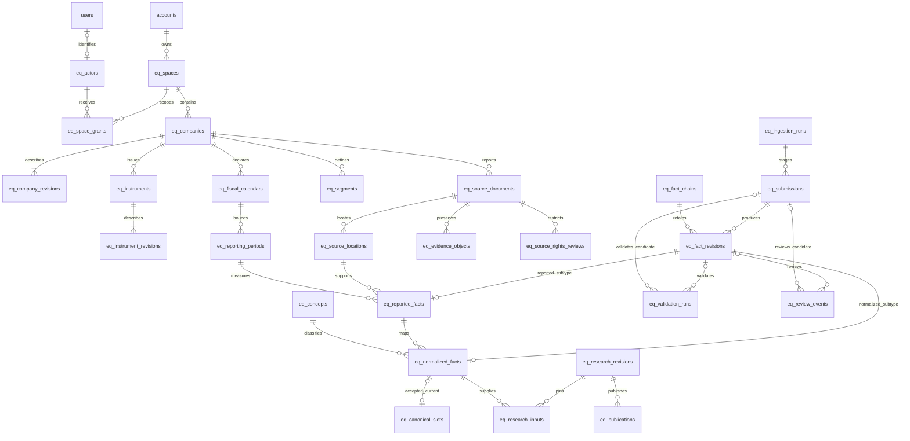
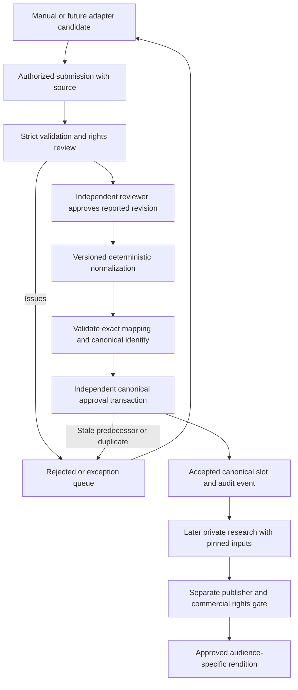

# ERFM Phase 1 Unit 3: proposed persistence and access architecture

Status: DESIGN PROPOSAL, pending approval before implementation.
Prepared 2026-09-22 against `feat/erm` at `31aeefa8`.

This document extends the implementation plan in [the master roadmap](ERFM_MASTER_ROADMAP.md)
and maps [the unchanged Unit 2 contract](ERFM_DATA_CONTRACT.md) to proposed storage.
It creates no schema, migration, service, permission grant or deployment.
Unit 2's recorded verification is 99 passed, zero failed. Live database state,
Postgres version, grants and applied migration history have not been inspected.

## 1. Existing conventions and their implications

These observations come only from files in the current worktree:

| Local evidence | Observation and ERFM implication |
| --- | --- |
| `src/shared/auth/nextauth.ts`, `src/core/types/next-auth.d.ts` | NextAuth JWT sessions expose `users.id`, role and subscription fields. Session role/plan are snapshots. Resolve current membership and capabilities for every protected operation. |
| `src/core/db/supabase.ts` | The server client uses the service role and bypasses RLS. The browser client uses an anonymous key. A NextAuth session does not establish a Supabase Auth identity. |
| `supabase/migrations/239_accounts.sql` | `accounts.id` and `users.id` are UUIDs; `users.account_id` supplies membership and `accounts.owner_user_id` identifies the holder. Account ownership is separate from a person's identity. |
| `supabase/migrations/240_account_invites.sql` | Existing server-only tables use RLS without public policies. Invite redemption uses one database function and row locking for an atomic operation. |
| `src/shared/admin/accountBoundary.ts` | Existing helpers include administrator exceptions and a permissive pre-migration fallback. These are not the proposed ERFM confidentiality boundary. |
| `src/shared/entitlements/resolveUser.ts`, `gate.ts` | Live entitlement resolution follows the account holder, but includes REFM project counts, administrator bypass and an unknown-plan access fallback. Do not import this resolver as ERFM authorization. |
| `supabase/migrations/006_permissions.sql`, `177_user_platform_subscriptions.sql` | Feature/plan/user overrides and platform subscription records exist. Migration 177's original comments are historical; the current resolver also reads subscription expiry fields. A billing record alone is not a research permission. |
| `supabase/migrations/230_refm_version_created_by.sql`, `233_refm_project_locks.sql` | Authorship retention and database-serialized conflict prevention have precedents. Reuse the engineering principles, not REFM tables or domain code. |
| `supabase/migrations/` | Shared ordered history, currently numbered through 244 in this checkout, with gaps and a legacy nonnumeric filename. This is not proof of the live or other developer's latest migration number. |

No existing helper or migration is changed by this proposal. Missing required
account/schema/capability data must deny ERFM access, with an operational error;
it must not activate the shared resolver's compatibility exceptions.

## 2. Storage boundary and key policy

Propose additive `public.eq_*` tables for the initial non-confidential dataset,
matching the existing schema convention. Enable RLS on every table, grant no
browser access, revoke table and function privileges from `PUBLIC`, `anon` and
`authenticated`, and explicitly grant only approved server operations. Inspect
actual default privileges in the later migration unit before relying on them.

Preferred eventual execution uses a dedicated ERFM database role with no
`BYPASSRLS`, no ownership of tables and only authorized routine access. Provisioning
that role/connection is a shared infrastructure decision requiring approval.
Compatibility with the existing service-role client is possible for the initial
public-data workflow, but leaves server authorization as the principal boundary;
RLS cannot constrain that role. Confidential ingestion stays disabled until its
separate access boundary has been approved and tested.

Use server-generated UUID primary keys, exposed as opaque strings to Unit 2.
Natural keys are additional uniqueness constraints, never ticker-based identity.
Do not accept client-assigned actors, owner accounts, approval times or revision
numbers. Dates use `date`; event times use `timestamptz(3)` and serialize as UTC
`Z` strings. A per-chain event sequence orders events sharing a millisecond.
Use checked text values for domain enums. JSONB is limited to versioned structured
details, not ownership, foreign keys, decimal numbers or uniqueness predicates.

Every scoped row carries `space_id`; reference targets expose a unique
`(space_id, id)` pair. Composite FKs enforce same-space ancestry for evidence,
facts and events. All history/lineage FKs default to `RESTRICT`/`NO ACTION`, never
cascade-delete research or financial evidence. Index referencing FKs and the
scope-first filters used by access checks. No partitioning is proposed initially.
Public master/taxonomy reads and later research input pins are the only explicit
cross-space reference paths. They require readable public-data targets and a
purpose-specific rights check; they do not authorize cross-space source/fact writes.

## 3. Proposed tables and relationships

Each table below has UUID `id` as PK unless another PK is specified. `->` means
an actual proposed FK. Rows described as immutable cannot be updated or deleted
by ordinary application operations. Referenced revisions remain resolvable.

### Ownership, actors and access

| Table | Essential columns, FKs and constraints |
| --- | --- |
| `eq_spaces` | `kind` = public_data / house / subscriber / confidential, `owner_account_id -> accounts`, name, status. Public-data space is a single FMP-controlled space; House has an explicitly selected internal account, never a guessed admin user. Subscriber spaces belong to client accounts. No confidential space is enabled initially. |
| `eq_actors` | Stable audit identity; nullable unique `user_id -> users ON DELETE SET NULL`, kind human/service, created time, retired time. UUID survives user deletion and is the actor ID emitted by the persistence adapter into Unit 2. No credentials or unnecessary personal information stored. Service actors cannot approve or publish. |
| `eq_space_grants` | `space_id -> eq_spaces`, `actor_id -> eq_actors`, capability, validity interval, granted/revoked actor references. One open grant per space/actor/capability. Revocation is recorded, not erased. Cross-account membership requires an explicit reviewed grant; account membership alone is insufficient. |
| `eq_access_events` | Immutable grant/revocation and administrative access audit, space, acting actor, affected grant, reason, recorded time. Scope managers cannot silently grant themselves reviewer/publisher powers. |

`eq_spaces.owner_account_id` uses deletion restriction: existing account-holder
deletion can cascade to `accounts`, so adding this FK changes deletion behavior.
Require an approved ownership-transfer/retention integration before enabling
production spaces. Do not silently cascade, orphan or rewrite ownership.

### Master data and taxonomy

| Table | Essential columns, FKs and constraints |
| --- | --- |
| `eq_sectors` | classification, classification_version, code, name, `parent_id -> eq_sectors`; unique classification/version/code; cycle checks. Versioned definitions are immutable. |
| `eq_companies` | Stable issuer identity, space, current master revision pointer. No uniqueness on company name. |
| `eq_company_revisions` | `company_id -> eq_companies`, revision number, legal/display/Arabic names, country, `sector_id -> eq_sectors`, industry, status, fiscal month/day, reporting currency, web/IR URLs, effective/recorded times, actor. Unique company/revision. Immutable. |
| `eq_instruments` | Stable identity, space, `company_id -> eq_companies`, current revision pointer. |
| `eq_instrument_revisions` | instrument FK, revision, ticker, exchange/MIC, optional ISIN, share class, trading currency, listing/delisting dates, status, effective/recorded times. Immutable. Prevent overlapping active ticker/MIC assignments within a space; historical ticker reuse is allowed. ISIN is not a required issuer key. |
| `eq_fiscal_calendars` | space, company FK, fiscal-year label, actual start/end, Q1-Q4 ends, version, recorded time. Immutable; unique company/year/version. Label is issuer-declared; fiscal-calendar corrections create a new row. |
| `eq_reporting_periods` | space, company/calendar FKs, instant/duration kind, instant date OR start/end, annual/quarterly/interim coverage, optional quarter/span/basis. Immutable; full shape uniqueness per calendar with null-safe comparison. |
| `eq_segments` | space, company FK, issuer code, name, kind, parent FK, inclusive validity dates, recorded time. Row is an immutable segment definition; reorganization creates new IDs. Same-company parent, no cycle, no overlapping validity for one issuer code without explicit review. |
| `eq_concepts` | PK `(code, taxonomy_version)`; definition, statement family, measurement kind, unit dimension, sign convention, general/sector/company applicability with sector/company FK where applicable. Immutable; same code across taxonomy versions preserves identity semantics. |

The initial sector/concept catalog contains public definitions only; company
applicability references a public-data issuer. Private KPI definitions must not be
placed in that global catalog. Private taxonomy namespaces and the mapping from
private issuer records to public issuer identity require later scoped design.
Research items can reference the public issuer directly without copying its master.

Company/instrument current pointers are rebuildable projections; a reader as of
an earlier time resolves immutable revisions. Their revision FKs include the
owning identity so a pointer cannot name another issuer's revision. Master-data
effective intervals must not overlap within the same recorded view.

Fiscal rules match Unit 2: quarter means exactly one declared quarter; H1/9M are
cumulative; H2 is standalone; custom interim states its basis explicitly. An
instant has no duration columns. Calendar end equals Q4 end; boundaries increase.
Do not use fixed day counts or the company master year-end to reinterpret history.
Compare fact identity by measurement dates, not period row ID or coverage label.

### Documents, evidence and ingestion

| Table | Essential columns, FKs and constraints |
| --- | --- |
| `eq_source_documents` | space, company FK, document chain UUID, version, title/type, headline period FK, publication date, optional retrieval time/URL/hash, language, assurance, classification, Unit 2 rights metadata, replacement self-FK. Unique chain/version; replacement has same company/space, consecutive version and no cycle. Immutable. |
| `eq_source_locations` | space, document FK, optional page/table/statement/note/reference. At least one nonempty locator; page positive. Immutable. |
| `eq_evidence_objects` | space, document FK, checksum, media type, byte length, immutable opaque storage reference, recorded actor/time. Optional: metadata-only/offline sources remain valid. Future object storage must prohibit overwrite and publicly accessible confidential objects. No file storage is implemented here. |
| `eq_source_rights_reviews` | space, document FK, reviewing actor, recorded/effective time, superseded review FK, evidence reference, permitted use/purpose/audience, geography, expiry, attribution and redistribution conditions, decision. Immutable; deny/unknown by default. |
| `eq_ingestion_runs` | space, entry method, initiating actor, batch/run/provider reference, extractor/version when applicable, idempotency key, payload digest, recorded time. Unique space/method/idempotency key; same key with different digest is a conflict. Manual entry also has a run. |
| `eq_submissions` | space, run FK, proposed concept FK, versioned candidate payload with decimal strings, submitter/time, payload hash. Immutable on submission; incomplete UI drafts need not become facts. Source references must resolve in the same space. |

Source headline periods need not equal comparative fact periods. A replacement
document does not automatically replace facts. Keep each location attached to the
exact original document. Evidence hash equality does not grant rights or justify
cross-space deduplication that exposes another tenant's source existence.

### Facts, validation and accepted current values

| Table | Essential columns, FKs and constraints |
| --- | --- |
| `eq_fact_chains` | space, layer reported/normalized, current accepted revision FK, next sequence/version metadata. Stable serialization row. Layer constrains revision subtype; pointers must reference the same chain. |
| `eq_fact_revisions` | space, chain FK, number, layer, recorded_at, effective_from, origin/reason, predecessor self-FK, submitting actor, submission FK. Unique chain/number. Immutable envelope; exactly one matching reported or normalized subtype, checked at transaction end. |
| `eq_reported_facts` | PK/FK `revision_id -> eq_fact_revisions`; space, company/period FKs, consolidation, optional segment/instrument FKs, original label/text/unit label, exact value/unit fields, mandatory document and location FKs, provenance actor/time/method/run coordinates. Composite FKs prove location belongs to document and every issuer-specific reference belongs to this company. |
| `eq_normalized_facts` | PK/FK `revision_id -> eq_fact_revisions`; space, `reported_revision_id -> eq_reported_facts`, concept code/version FK, exact value/unit fields, mapping version, mapping actor/time, ordered transformation details/rule versions. No independent writable issuer/period/scope. |
| `eq_validation_runs` | space, submission FK OR revision FK (exactly one), immutable payload digest, ruleset and validator versions, validating actor/time, structured issues and result. Store what actually ran; passing foundational checks is not full accounting certification. |
| `eq_review_events` | space, submission FK OR revision FK (exactly one), per-subject sequence, submit/approve/reject/supersede/invalidate/withdraw event, acting actor, recorded/effective time, expected predecessor, replacement revision FK, validation-run FK, rights-review FK, reason. Immutable. Accepted revision approvals must target validation of that exact revision payload. |
| `eq_canonical_slots` | space, canonical identity columns, current normalized revision FK or null, generation counter, last event FK. Unique null-safe identity; current revision unique when present. Mutable projection written only by the approval transaction. Never an alternate store of the amount. |
| `eq_operation_receipts` | space, operation, caller actor, idempotency key, request digest, resulting event/revision identifiers. Unique space/operation/key; part of the same transaction, never a success receipt before commit. |

Source rights and validation references on approval events are mandatory where
the action requires them; nullability is event-kind constrained. A normalized
approval retains both the normalized and source approval events as evidence.
Record source/master revision selections and capability-policy version in the
event details, so later changes do not rewrite what the reviewer examined.
Submit/reject events and pre-approval validation attach to the submission. Approval
allocates the fact revision, inserts its final validation record and approval event
in the same transaction; no revision FK points at a candidate that does not exist.
Submitting again creates a new immutable submission, preserving rejected attempts.

KPIs use `eq_concepts` with statement family `kpi`, and the same fact pipeline.
Company/sector applicability and extensible quantity codes support future telecom,
banking, insurance and utility definitions without a separate KPI value table.
No taxonomy seeds or financial values are proposed in this unit.

### Later research/publication extension, not initial persistence scope

Reserve `eq_research_items` (space, company, kind), immutable
`eq_research_revisions` (item, author, approved input snapshot, content hash),
`eq_research_inputs` (research revision + exact normalized revision composite PK),
`eq_publications` (research revision, audience, publisher, rights decision,
publication/withdrawal events), and `eq_publication_inputs` (publication + exact
normalized revision composite PK, source rights-review reference). All references
are FKs. These are boundary placeholders for later research units, not permission
to build models, reports or publication now.

Private research can pin readable approved public inputs through an explicit
read/import operation. Private raw evidence cannot flow in the reverse direction.
Publication exposes an approved immutable rendition, not the House workspace or
unfiltered joined sources. Current subscription access is checked at delivery.

### Table relationship diagram

The principal paths are shown; the tables above define the additional audit FKs.

## 4. Exact decimals and validation boundaries

Propose retaining `decimal_text` verbatim with Unit 2's plain-decimal grammar,
plus an unconstrained `numeric` value derived from that string for exact database
comparison. The numeric representation is generated or maintained by a protected
routine; clients cannot supply two inconsistent values. Keep reported display text
separately. A fixed `numeric(p,s)` would round excess scale on assignment, so it
is not the proposed ingestion type. Reject non-finite values explicitly.
See [PostgreSQL numeric types](https://www.postgresql.org/docs/current/datatype-numeric.html).

Known values require text and numeric value with no missing reason. Missing values
require one Unit 2 reason and both amount columns null. Unit columns discriminate
money/money-per-share/shares/ratio/quantity, currency where required, scale within
-12..12 and ratio representation. Normalized values require scale zero or fraction.
Original minus signs, trailing zeros and reported text survive unchanged.

Wire values and JSONB amounts are strings. RPC responses must cast numeric amounts
to text before JSON encoding; a JavaScript JSON-number round trip is unacceptable.
The future adapter tests values above JavaScript's exact integer range and long
fractions, missing values and negative zero. No `Number`, float or implicit rounding
at any input, storage, validation or output boundary.

Unit 2 does not bound decimal length. Propose a persistence limit of 1,000 total
digits, enforced before numeric casting, subject to approval as a storage limit,
not a silent domain-contract change. Out-of-range input is rejected explicitly.
Transformation arithmetic and rounding policy need separate approval and exact
implementation; arbitrary division and FX are not certified by Unit 2 validators.
Initially approve only transformations whose exact results can be deterministically
verified. Human approval cannot waive a missing transformation implementation.

| Boundary | Required checks |
| --- | --- |
| Input/service | Strict Unit 2 parsing, trusted actor/context, size limits, authorization, source and concept resolution. Never treat successful parsing as approval. |
| Persistence | PK/FK, scope/issuer ownership, required lineage, decimal/missing shape, period shape, unique identities and allowed transitions. Cross-row rules belong in protected transactions/constraint triggers, not cross-table CHECK expressions. |
| Approval | Revalidate authoritative joined rows, exact mapping arithmetic, rights, chain predecessor, applicable master data, current capabilities and independent reviewer. |
| Engine adapter | Only explicitly approved, eligible revisions; reconstruct Unit 2 shapes and validate them. Reject inconsistent records instead of repairing them silently. |

## 5. Immutable revisions and point-in-time history

Fact payloads and source revisions are append-only. Review and supersession append
events; only chain heads and canonical slots change. The adapter derives Unit 2's
review and forward lifecycle link from events and the immutable predecessor link.
This preserves reciprocal supersession without editing old amounts or adding
fields to Unit 2. A correction proposal is a submission until accepted; allocate
the next chain number inside approval to avoid rejected attempts leaving gaps.

Issuer restatement, extraction correction, reviewer correction, unit correction
and taxonomy remap remain distinct. Reported revisions preserve issuer, measurement
dates and scope. Taxonomy remaps affect normalized chains only. A restated reported
revision requires a new normalization chain; existing normalized chains keep their
exact original source reference. Superseding that source atomically removes all
dependent current normalized slots, even if replacements are not ready. The result
is an explicit unavailable canonical input, never a stale value presented as current.

An identity error uses withdrawal plus a new chain, preserving the original.
Unit 2 has no withdrawn/invalidated lifecycle variant: these are storage eligibility
events, not new domain variants. Exclude those records from current canonical reads;
historical reads return the original domain record alongside a separate access/audit
envelope. A future UI needing these states in the domain requires explicit approval.

Keep measurement date, effective_from, source publication date, source retrieval
time, recorded_at and approval time distinct. An as-of query supplies both a
knowledge cutoff and an effective cutoff: use only events recorded by the knowledge
cutoff, then apply effective boundaries. An approval recorded later cannot become
known earlier just because effective_from was backdated. Initial operations disallow
future-dated approvals; backdated effective corrections require reason and review.
Enforce chronological chain boundaries and half-open effective intervals.

Example without financial values: a correction recorded on September 22 and
effective September 1 is absent from a September 10 knowledge view. It can appear
in the September 22 knowledge view for September 10 effective time. Immutable
research input lists preserve exactly the revisions used, even after restatement.
Historical access still requires current confidentiality and licensing permission.

## 6. Approval workflow and transactions

Approval requires the reviewer to differ from the submitter and, for normalized
facts, from the mapper. Publisher and data reviewer are separate capabilities.
The same authorized reviewer may approve both layers if they created neither.
No self-approval exception is proposed; staffing implications require approval.

The canonical identity exactly follows Unit 2: company, measurement kind/start/end
(instant date in both bounds), consolidation, optional segment/instrument, concept
code and normalized unit dimension/currency (quantity includes its code). Add space
as the access partition. Exclude amount, label, source, scale, taxonomy version and
period row ID. Quarter and cumulative interim differ by dates. Null optional
dimensions compare equal, using `NULLS NOT DISTINCT` if the approved database
version supports it, or equivalent checked non-null key columns. A hash alone is
not the uniqueness authority; confirm the full identity tuple on collisions.

Each approval is one database transaction, not several independent REST writes:

1. Authenticate through NextAuth; resolve current user, actor and account. Obtain
   the actor from trusted server context, never the request body. Within the
   operation, recheck and lock relevant grant/rights state against revocation.
2. Claim the idempotency receipt key and verify request digest. Completed retries
   return the same result; another payload under that key fails.
3. Lock grants/rights, reported chains, normalized chains, then canonical slots,
   consistently ordered by stable keys within each group. Source supersession and
   normalization approval both lock the reported chain, preventing a new mapping
   from escaping dependent invalidation. Other operations use the same order.
4. Create absent slot rows with conflict-safe insertion, then lock them; an
   unlocked absence is not a concurrency guard. Lock both old and new identity
   slots for a remap. Verify caller's expected head and generation.
5. Revalidate immutable payload, exact source revision eligibility, rights and
   validation evidence. Allocate the next consecutive version. A different source
   competing for an occupied identity produces a conflict, not last-write-wins.
6. Insert accepted revision/subtype, approval/supersession events and dependency
   invalidations. Move pointers only if expected generations still match. Assert
   one accepted current revision per chain and one accepted current mapping per slot.
7. Record the operation receipt and commit all changes together. Any failure
   rolls everything back. Return stable conflict/validation/authorization codes;
   redact evidence and identifiers outside the caller's access scope.

For the first implementation, serialize approvals and permission changes on the
space row before taking child locks. Lock current user/account membership rows
first, then spaces, documents, grants/rights, chains and slots in that order.
Rights-review insertion locks its document and space: locking only an immutable
old review would not prevent a new revocation row. All approval, revocation and
withdrawal routines follow this protocol. This intentionally trades initial
per-space write throughput for simpler correctness; narrow locks only after
measured need and concurrency tests. Direct grant/event/slot writes are forbidden.

Ordinary reads can use committed snapshots. Approval uses explicit row locks and
unique constraints, with serializable isolation for operations whose predicate
checks cannot be covered by locked scope/chain rows. Retry the whole transaction
on serialization/deadlock failures with bounded retries and the same idempotency
key. A unique-conflict response is not automatically retried as an overwrite.
See [PostgreSQL transaction isolation](https://www.postgresql.org/docs/current/transaction-iso.html).

| Operation | Atomic requirement |
| --- | --- |
| Submit | Candidate, mandatory source references, run association and receipt succeed together. |
| Approve or reject | Exact payload validation, current permissions, event and resulting head/slot agree. Rejection never changes the accepted head. |
| Restate source fact | New revision, supersession, all dependent slot invalidations and receipt commit together. |
| Remap | Old slot release and new slot claim are atomic; conflicting destination leaves both unchanged. |
| Withdraw or restrict rights | Eligibility removal and audit commit together; dependent current reads fail immediately. |
| Later publish | Pin approved inputs and rights decisions with publication event; delivery rechecks expiry/revocation. External delivery occurs only after commit through a future outbox. |

Functions should use invoker privileges where feasible, fixed search paths and
schema-qualified objects. Any definer function requires reviewed ownership and
explicit EXECUTE revocation/grants. Supplied actor IDs are trustworthy only behind
the authenticated server boundary; a service-role caller is privileged regardless
of RLS. Never expose these routines to browser roles.
For routine-only access, propose a narrowly privileged non-login function owner
separate from the table owner, without BYPASSRLS, and reviewed definer entry points;
the server login receives EXECUTE only. RLS predicates use transaction-local actor
and space context established from verified server identity, checking live grants
and eligibility for both row visibility and inserted/updated scope. This context is
not proof of identity on its own. Direct user SQL and browser function execution
remain prohibited. If an invoker model is selected instead, its required table
privileges and protection against bypassing the workflow need explicit review.

## 7. Authorization matrix and isolation

All permissions are space-scoped and deny by default. The following are capability
bundles, not new NextAuth roles. Account ownership or platform admin status grants
none of the research permissions automatically.

| Actor/capability | Public canonical read | House drafts | Submit facts | Approve facts | Publish | Subscriber private | Confidential |
| --- | --- | --- | --- | --- | --- | --- | --- |
| Anonymous | No raw dataset | No | No | No | No | No | No |
| Research subscriber | Only entitled published content | No | No | No | No | Future own-space access only | No |
| Data-entry operator | Assigned scope | Only explicit read grant | Assigned scope | No | No | Only explicit own-space grant | Disabled initially |
| Data reviewer | Assigned scope | Only explicit read grant | Separate entry grant | Assigned scope, independent reviewer | No | Only explicit grant | Disabled initially |
| House analyst | Approved licensed inputs | Assigned House space | Separate entry grant | Separate reviewer grant | No | No automatic access | Disabled initially |
| Publisher | Publication-required inputs | Assigned approved research | No implicit grant | No implicit grant | Assigned House space after rights check | No automatic access | Never to public feed |
| Subscriber researcher, future | Licensed input access | No | Own private scope only, later unit | No shared-data approval | No House publication | Own authorized space | No |
| Space access manager | No implicit content grant | No implicit grant | No | No | No | Membership management only | Separate controlled process |
| Platform administrator | No implicit research grant | No implicit grant | No | No | No | No implicit grant | No implicit grant |

House's unlimited company capability is explicit and separate from administration
and metered API/AI use. Research subscription delivery later needs an approved
platform-specific entitlement adapter over FMP's existing account/subscription
infrastructure; unknown product/plan, expiry or failed lookup denies access.
No ERFM plan keys, billing rows or shared entitlement changes are created now.

Public-data means source classification and reuse eligibility, not anonymous API
access. Every private query scopes the root and joined records, including searches,
counts, exports, evidence links and error messages. Cache keys include space,
audience and authorization version; private responses cannot enter shared caches.
Revoked membership must not survive in a long-lived JWT or signed evidence URL.

Confidential material requires a separately provisioned private storage/database
boundary and credentials inaccessible to the public-data ingestion/publishing
service. A `confidential` flag under the same omnipotent client is not sufficient.
The concrete deployment choice remains an approval decision. Until then, reject
confidential uploads and ingestion. Unit 2 already refuses confidential sources
for shared canonical approval; do not weaken that check for private workflows.
Any later confidential approval path requires its own reviewed policy contract.

Public information encountered in advisory work must be independently sourced from
a public reference and separately reviewed in the public-data space. Never copy a
mixed client document into the shared dataset or change its space to promote it.

RLS is defense in depth for ordinary roles, not a service-role authorization
guarantee. Table owners and `BYPASSRLS` roles can bypass it; policies must be tested
under actual execution roles. See [PostgreSQL row security](https://www.postgresql.org/docs/current/ddl-rowsecurity.html).

## 8. Licensing and commercial publication

Unit 2's source rights classification remains intact. The separate rights review
records the evidence and permitted purposes without claiming that public access
establishes commercial redistribution rights. Unknown/internal-only/confidential
sources cannot enter shared canonical approval. A `public_reference` basis or
`licensed` reference still requires a verified permitted-use decision.

Evaluate ingestion, internal analysis, derived output, subscriber publication,
raw redistribution and file reproduction separately. Apply the intersection of
conditions across all contributing inputs, including attribution, audience,
territory, expiry and permitted derivatives. Deny an unspecified use. Contract
interpretation belongs to an authorized rights reviewer; this design supplies
enforcement metadata, not legal clearance.

Publication needs a rights decision tied to exact source/input versions and the
specific audience. License expiry or revocation stops new distribution and evidence
download; it does not rewrite historical approvals. Preserve the restricted audit
record subject to an approved retention/deletion policy. Already downloaded reports
cannot be technically recalled; withdrawal notices and redistribution obligations
need a later operational policy. Evidence retention may differ from permission to
continue using its financial facts.

## 9. Manual entry and future adapters

The future ERFM-local service resolves NextAuth identity to `eq_actors`, loads
authoritative references and calls Unit 2's `prepareManualSubmission` with trusted
context. Persist its submitted reported result and proposed concept through the
same staged pipeline used by later imports/extraction/providers. No adapter may
set approval, overwrite canonical slots or omit source references.

Store provider/extractor metadata only in provenance/run details; engines receive
the Unit 2 reported/normalized projections. Provider payload retention is licensed
and space-scoped. Request/run keys prevent retry duplicates but do not replace
canonical identity checks. Extraction confidence can inform review, never confer
approval. API keys, credentials and raw confidential payloads never enter audit logs.

## 10. Migration sequence and REFM coordination

These are review stages, not allocated migration numbers or executable SQL:

1. Approve this design's decisions below. Agree identity, retention and execution
   privileges with the owners of shared accounts/auth and the REFM migration history.
2. In a separately authorized unit, verify target Postgres version, existing FK
   shapes, default privileges and applied history in an isolated test environment.
   Coordinate one migration owner and reserve numbers at that time. Do not infer
   the next number from this checkout or inspect another worktree without approval.
3. Add namespace security, actors/spaces and grants; then master/calendar/taxonomy
   tables; then sources/rights/ingestion; then facts/events/slots and transactional
   routines. Each stage must be inaccessible to public roles from creation.
4. Add constraints and indexes, then enable the server adapter only after a fully
   verified schema capability check. No permissive fallback for partial migrations.
5. Seed only explicitly approved reference definitions and scope grants. No financial
   fixtures, administrator-to-research-role conversion or bulk backfill is implied.
6. Deploy separately after approval. Keep REFM/shared DDL out of ERFM migrations;
   necessary account deletion integration is a separately coordinated shared change.

Use the repository's agreed ordered migration convention and ERFM-identifiable
names. Do not create files, reserve numbers or apply migrations in Unit 3. Later
rollback should disable access first and preserve history; prefer corrective forward
migrations over destructive table drops. No schema reset, rebase or history rewrite.
Research/publication and confidential infrastructure remain later stages requiring
their own scope approvals.

## 11. Required future verification

Before any persistence release, verify decimal string round trips and size rejection;
Unit 2 projection compatibility; missing-value preservation; period/calendar and
source/issuer ownership; null-safe duplicate identity; source and normalized chain
supersession; same-millisecond event ordering and point-in-time reads.

Use concurrent database sessions to prove two approvals cannot both win, first-slot
creation cannot race, stale generation conflicts are visible, source restatement
cannot race a new normalization, and idempotent retries survive uncertain commit
responses. Inject a failure between revision/event/slot writes and verify rollback.
Test rights/grant revocation racing approval and repeat with actual deployed roles.

Access tests must cover cross-account IDs, cross-space evidence joins, counts,
exports, cache reuse, admin without research grants, deleted users, missing schema,
unknown plan, lapsed subscription and expired source rights. Prove anonymous and
authenticated Data API roles cannot read tables or execute approval functions.
No production or database-mutating tests run in this design unit.

## 12. Risks and decisions requiring approval

| Decision | Proposed default and blocking consequence |
| --- | --- |
| UUIDs and actor mapping | UUID storage IDs and stable `eq_actors` IDs in domain provenance; approve adapter semantics before persistence. |
| Decimal capacity/arithmetic | Unconstrained numeric plus preserved string; explicit 1,000-digit storage limit; exact transformation and rounding policy still need approval. |
| Execution role | Prefer restricted ERFM role; service-role compatibility is a documented weaker boundary. Approve provisioning and routine privileges before release. |
| Account deletion and ownership | Restrict deletion while a space references an account; approve transfer, retention and shared deletion-flow integration. |
| Scope bootstrap | Explicit FMP account selection, public-data/House space ownership and initial grants, never inferred from admin role. |
| Separation of duties | No self-approval, with separately granted publishing and rights-review authority; confirm staffing and access-manager controls. |
| Entitlement integration | Reuse account/subscription infrastructure through a reviewed ERFM adapter; product keys, subscriber rights and expiry behavior need approval. |
| Confidential isolation | Disabled until separate infrastructure, retention and policy are approved; no automatic promotion to public data. |
| Rights interpretation | Confirm who may certify each permitted use, what evidence is retained, and how revocation affects distribution. |
| Master data and identity | Approve taxonomy, quantity definitions, ticker overlap rules and calendar correction governance; identity corrections use withdrawal/new chain. |
| Historical eligibility | Event-derived review/lifecycle plus an external withdrawal envelope; domain lifecycle extension requires separate approval if needed. |
| Migration ownership | Coordinate shared history with REFM at implementation time; no migration number is reserved here. |

## 13. Unit 3 verification scope

Documentation-only verification checks local relative links, Markdown fence balance,
required design sections, prohibited dash characters, file scope and whitespace.
Review the entire staged diff before committing. No Markdown-specific check command
is declared in `package.json`; structural checks do not claim Mermaid rendering.
TypeScript, lint, build and the Unit 2 verifier need no rerun for this document-only
change. No application, domain contract, migration, dependency, environment or
deployment configuration changes are part of this unit.

Stop after a local documentation commit. Review the decisions above before approving
any persistence implementation or another unit.
